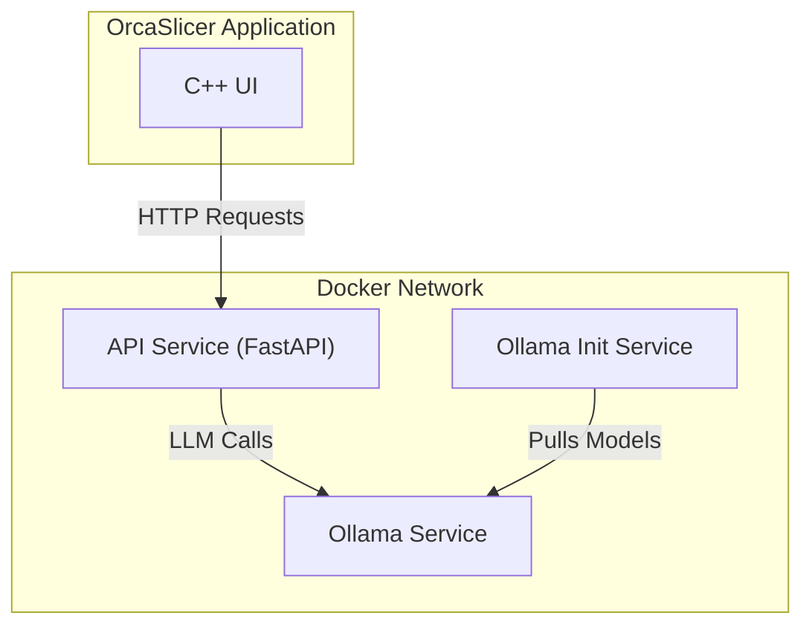

# Orca Agents: AI Assistant Backend

[](https://github.com/cbatu/OrcaSlicer/actions/workflows/ci.yml)
[](https://github.com/astral-sh/ruff)
[](https://github.com/astral-sh/uv)
[](https://docs.pytest.org/en/latest/)
[](https://pytest-cov.readthedocs.io/en/latest/)

[](https://www.python.org/)
[](https://fastapi.tiangolo.com/)
[](https://www.docker.com/)
[](https://github.com/smol-ai/smol-agent)
[](https://ollama.com/)

This directory contains the containerized Python backend for the AI Assistant in OrcaSlicer. It is a self-contained system built with **FastAPI** and **`smolagents`** that provides the chat logic and agentic capabilities for the main application.

> For a complete technical breakdown, please see the **[Specification Library](./specs/README.md)**.

## Architecture

The system runs as a collection of orchestrated Docker services, ensuring a clean separation of concerns and a consistent environment.



-   **API Service**: The core FastAPI application that serves the API, manages agent logic, and handles chat sessions.
-   **Ollama Service**: Runs the core Ollama server for LLM inference.
-   **Ollama Init Service**: A one-off startup service that pulls the required LLM models specified in the `.env` file, ensuring they are available before the API starts.

## 🚀 Quick Start

### Prerequisites

-   Docker and Docker Compose
-   `uv` (for local Python dependency management if needed)

### 1. Configure Your Environment

First, create your local configuration file from the example.

```bash
cp .env.example .env
```

Now, open the `.env` file and review the model settings. The defaults are set for a standard development machine.

```env
# .env
PRIMARY_MODEL=ollama/qwen3:0.6b
REASONING_MODEL=ollama/qwen:7b
```

### 2. Launch the Backend

The `Makefile` provides a simple interface for managing the application stack.

```bash
# Build images and start all services
make up
```

This command will:
1.  Build the `api` service's Docker image.
2.  Start the `ollama` service.
3.  Run the `ollama-init` service to download the models.
4.  Start the `api` service with hot-reloading enabled.

## 🛠️ Development Workflow

All primary development tasks are run through Docker via the `Makefile` to ensure consistency.

| Command         | Action                                                                   |
| --------------- | ------------------------------------------------------------------------ |
| `make up`       | Builds and starts the entire container stack.                            |
| `make down`     | Stops and removes the containers.                                        |
| `make logs`     | Tails the logs from all running services.                                |
| `make test`     | Runs the `pytest` test suite inside the `api` container.                 |
| `make lint`     | Runs the `ruff` linter to check for style issues.                        |
| `make format`   | Runs the `ruff` formatter to automatically format the code.              |

### API Endpoints

The API is served at `http://localhost:8000`. Key endpoints include:

-   `GET /api/health`: Health check for the service and its connection to Ollama.
-   `POST /api/chat`: The primary endpoint for chat interactions.

For the detailed API contract, see the [API Endpoints Specification](./specs/api_endpoints.md).

### Python Dependencies

Dependencies are managed with `uv` and defined in `pyproject.toml`. They are automatically installed inside the container when you run `make up`. To modify dependencies:

1.  Add or remove packages locally: `uv add <package>` or `uv remove <package>`.
2.  Rebuild the container: `make up`.

## ⚙️ Configuration

The application is configured via environment variables defined in the `.env` file. These are loaded into a type-safe Pydantic settings object. See `config.py` for all available options.

## 📄 Specifications

This project uses a "specs-as-code" approach. The `specs/` directory is the source of truth for all architecture, coding standards, and implementation details. Before contributing, please familiarize yourself with these documents. 